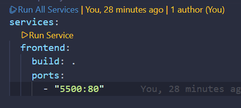

# TpCAC Front-End

## Proyecto final integrador del curso Codo a Codo 4.0 


Desarrollo de una página web tipo ecommerce integrando HTML, CSS y Javascript. Esta página web implementa una API REST creada en otro repositorio que consume datos en tiempo real.


## 🚀Ejecución
El proyecto se puede levantar de tres formas:
1. Utilizando la extensión live server de Visual Studio Code.
2. Subir el proyecto en cualquier servidor estático, un servidor muy conocido para esto es [Netlify](https://www.netlify.com/).
3. Levantar los contenedores Docker de frontend y backend.

> **Nota**: Pueden ocurrir errores según la opción elegida para levantar el proyecto. 
> * Si utilizas la extensión Live Server, verifica que la clase ProductController dentro del backend tenga la anotación `@CrossOrigin(origins="http://127.0.0.1:5500/")`
> * Si utilizas servidores estáticos deberás modificar la variable `api_backend` que se encuentra harcodeada en el archivo `static/js/crud.js` por la nueva url del servidor del backend.

### Docker
Este `docker-compose.yml` orquesta únicamente los servicios del front-end. 
Puedes levantar el contenedor haciendo click en Run All Services.


> **Nota:** Para el correcto funcionamiento de la web es necesario correr el `docker-compose.yml` del front-end como del backend.

También se puede levantar el proyecto con el siguiente comando dentro de la carpeta.

```
docker compose up --build
```
Repositorio de backend: [TpCaC-Backend](https://github.com/Nahu2412/TpCAC-Backend)

> **Nota:** Utilizando docker es necesario modificar la anotación `@CrossOrigin` del repositorio del backend deberia quedar `@CrossOrigin(origins="http://localhost:5500/")` para que funcione correctamente